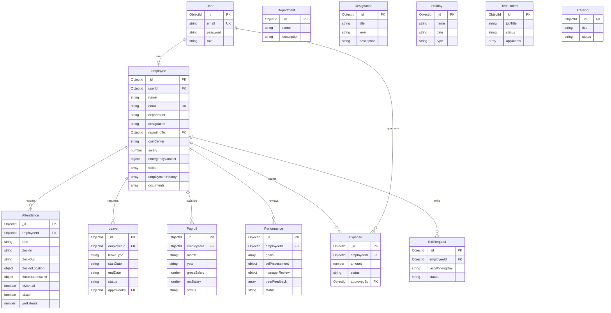

# HRMS — Database schema & ER overview

MongoDB is used with Mongoose. Collections map one-to-one with model names below. This document satisfies the **database schema / ER diagram** deliverable; diagrams render on GitHub/GitLab.

---

## Entity relationship (Mermaid)

---

## Design notes

- **Departments** and **designations** are separate collections for CRUD; **Employee** still stores `department` and `designation` as strings for fast display and legacy forms (you may normalize to `ObjectId` refs in a future migration).
- **Recruitment** embeds **applicants** as a subdocument array (not a separate collection).
- **User** links to **Employee** via `Employee.userId` for login/role and self-service.

---

## PDF / file artifacts

- Employee **profile images** and **documents**: files on disk under `backend/uploads/` with paths stored on the employee record.
- **Payslip** and **offer letter**: generated on the fly (PDF), not stored in MongoDB.
